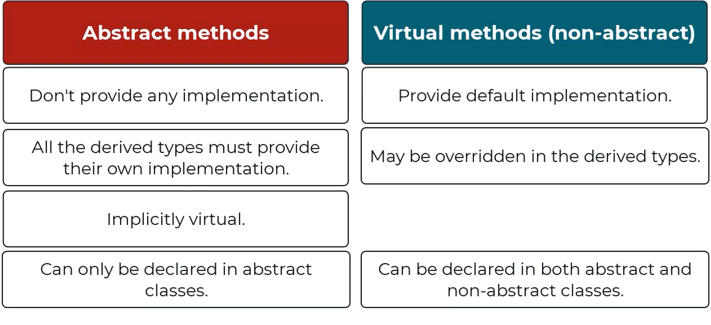
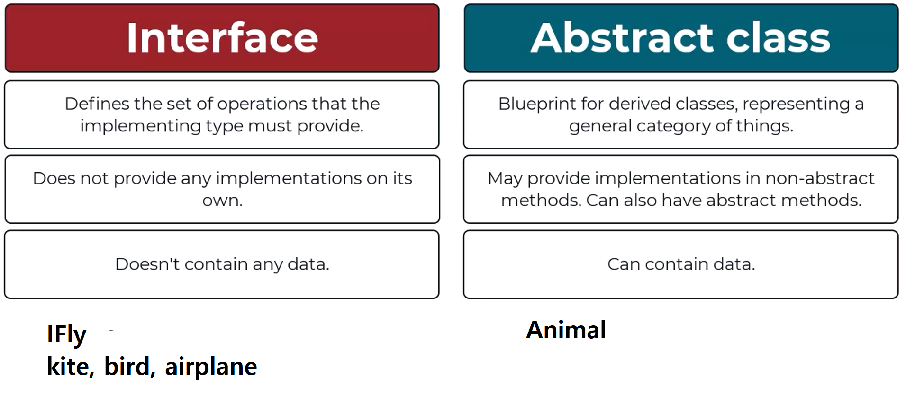
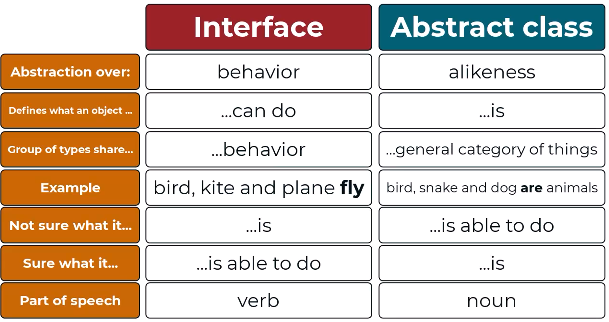
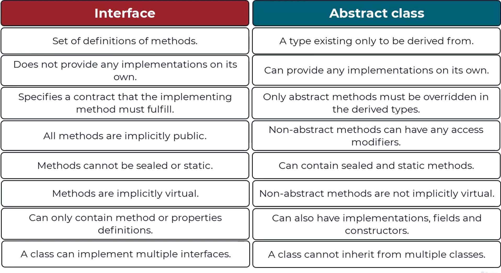

# Fundamentals
## Summary: Understanding Variables and Types in C#

- Introduction to variables:
  - Variables are used to store values in a program.
  - Each variable has a name and a type.

- Types of variables in C#:
  - int: Used for storing whole numbers.
  - string: Used for storing textual data.

- Declaration and initialization of variables:
  - Declaration: Specifying the type and name of a variable.
  - Initialization: Assigning an initial value to a variable.
  - Once declared, the type of a variable cannot be changed.

- Duplicating lines of code in Visual Studio:
  - Shortcut: Ctrl+D to duplicate a line.

- Example of variable declaration and initialization:
```csharp
  string userInput = "A";
  int number = 4;
```

- Error handling:

    - Attempting to use a variable before declaration or initialization results in compilation errors.
    - Assigning a value of the wrong type to a variable also results in a compilation error.
- Multiple variable declaration:
    - Multiple variables of the same type can be declared and initialized in a single line.
- Importance of variable naming:
    - Descriptive and meaningful variable names improve code readability.
    
    ----------------------------------------------------------------
    
## Summary: Understanding Basic Operators and Precedence in C#

- Introduction to C# operators:
  - C# provides built-in operators for performing basic operations on values.
  - Operators include addition, subtraction, multiplication, and division.

- Operator behavior with different types:
  - Operators can behave differently based on the types of operands.
  - Addition operator can concatenate strings or add numbers.

- Operator precedence:
  - Operators have precedence, determining the order of evaluation in expressions.
  - Multiplication and division have higher precedence than addition and subtraction.
  - Parentheses can be used to control the order of evaluation.

- Unary operators:
  - Unary operators, such as ++ and --, require only one operand.
  - They increment or decrement a number by one.

- Example code demonstrating operator behavior and precedence.

```csharp
int a = 5, b = 3;
Console.WriteLine(a + b);  // Addition: 8
Console.WriteLine(a - b);  // Subtraction: 2
Console.WriteLine(a * b);  // Multiplication: 15
Console.WriteLine(a / b);  // Division: 1

string str1 = "Hello", str2 = "World";
Console.WriteLine(str1 + str2);  // Concatenation: HelloWorld
Console.WriteLine(str1 + a);     // Concatenation with int: Hello5

// Error: Subtraction between string and int
// Console.WriteLine(str1 - a);

// Parentheses to control evaluation order
Console.WriteLine((str1 + a) + b);  // Corrected: Hello58

int c = 10, d = 5;
Console.WriteLine(c++);  // Post-increment: 10
Console.WriteLine(--d);  // Pre-decrement: 4
```


## Summary: Understanding the var Keyword in C#

- Purpose of the var keyword:
  - The var keyword is used to declare variables with implicit typing.
  - It allows the compiler to infer the type of the variable from its initialization.

- Implicitly and explicitly typed variables:
  - Explicitly typed variables require the type to be explicitly declared.
  - Implicitly typed variables use the var keyword, and the type is inferred by the compiler.

- Example usage of the var keyword:
```csharp
  var str = "Hello";  // Implicitly typed as string
  var num = 10;        // Implicitly typed as int
```

- Compiler inference:

    - The compiler infers the type based on the initialization value.
    - Types inferred by the compiler cannot be changed after declaration.
- Error handling:
    - implicitly-typed variables must be initialized during declaration.
- Personal preference:
    - Some developers prefer using var for clarity, especially when types are obvious from the initialization.
    - Explicitly declaring types may be preferred for clarity in complex scenarios or calculations.


## Summary: Understanding Booleans and New Operators in C#

- Introduction to the bool type:
  - bool represents a boolean value, which can be either true or false.

- Usage of Booleans:
  - Booleans are used to check conditions or expressions for truthfulness.

- Equality and inequality operators:
  - Equality operator (==) checks if two values are equal.
  - Inequality operator (!=) checks if two values are not equal.
  - Logical negation operator (!) negates a boolean value.

- Comparison operators:
  - Comparison operators (<, >, <=, >=) compare numerical values.
  - They return true or false based on the comparison result.

- Modulo operator (%):
  - Modulo operator returns the remainder of division.
  - Commonly used to determine even or odd numbers.

- Examples of operator usage in C# code.

```csharp
string userInput = "ABC";
bool isInputEqualToABC = userInput == "ABC";   // true

int number = 10;
bool isNumberGreaterThanFive = number > 5;     // true
bool isNumberSmallerThanTen = number < 10;      // false
bool isNumberEqualToTen = number == 10;         // true
bool isNumberNotEqualToTen = number != 10;      // false
bool isNumberGreaterOrEqualToTen = number >= 10; // true
bool isNumberSmallerOrEqualToSix = number <= 6;  // false

int moduloResult = 10 % 3;                     // 1
bool isModuloResultEqualToOne = moduloResult == 1; // true
```


## Summary: Understanding Logical Operators and Short-Circuiting in C#

- Introduction to logical operators:
  - Logical operators include the AND (&&) and OR (||) operators.
  - Used to combine multiple conditions in logical expressions.

- AND operator:
  - Returns true only if all conditions are true.
  - Example: `(number > 4 && number < 9)`

- OR operator:
  - Returns true if at least one condition is true.
  - Example: `(number == 2 || number > 6)`

- Combining logical operators:
  - Multiple conditions can be combined in a single expression.
  - Parentheses can be used for clarity and to define the order of evaluation.

- Short-circuiting optimization:
  - C# optimizes logical expressions by short-circuiting.
  - If the result is determined by the left side of an OR expression, the right side may not be evaluated.
  - If the result is determined by the left side of an AND expression, the right side may not be evaluated.

- Naming Boolean variables:
  - Use descriptive names in the form of a question answerable with true or false.
  - Enhances readability, especially in conditional statements.

```csharp
int number = 7;
bool isInRange = number > 4 && number < 9;          // false
bool meetsCondition = number == 2 || number > 6;    // true
bool complexExpression = (number == 123) || (number % 2 == 0 && number < 20);  // true

// Short-circuiting example
bool shortCircuitingExample = (number > 5) || (SomeComplexMethod());  // If number > 5, SomeComplexMethod() won't be called

```
>Understanding logical operators and short-circuiting in C# is crucial for writing efficient and readable code. Proper use of parentheses and optimization techniques like short-circuiting can enhance code performance and maintainability.

## Summary: Understanding If/Else Conditional Statements in C#

- Introduction to if/else statements:
  - If/else statements are used to execute different code blocks based on conditions.

- Basic if/else usage:
  - Code within the "if" block is executed if the condition evaluates to true.
  - Code within the "else" block is executed if the condition evaluates to false.

- Checking conditions:
  - Conditions are expressed as boolean expressions.
  - Conditions can be simple comparisons or complex expressions.

- Handling multiple conditions:
  - Multiple conditions can be handled using nested if/else statements.
  - Each condition is evaluated sequentially.

- Understanding scope:
  - If/else statements define scopes for code blocks enclosed within braces.
  - Variables declared within a scope are only accessible within that scope.

- Example usage of if/else statements in C# code.

```csharp
string userInput = "Test";

// Basic if/else
if (userInput != "ABC")
{
    Console.WriteLine("This message was printed because user choice is not equal to ABC.");
}
else
{
    Console.WriteLine("This message was printed because user choice is equal to ABC.");
}

// Checking length of input
if (userInput.Length > 10)
{
    Console.WriteLine("Input is longer than ten characters.");
}
else
{
    Console.WriteLine("Input is shorter than or equal to ten characters.");
}

// Handling multiple conditions
if (userInput.Length <= 3)
{
    Console.WriteLine("Short answer");
}
else if (userInput.Length > 3 && userInput.Length < 10)
{
    Console.WriteLine("Medium answer");
}
else
{
    Console.WriteLine("Long answer");
}
```

## Summary: Understanding Scopes and Code Blocks in C#

- Introduction to scopes:
  - Scope defines where a particular variable is accessible within a program.
  - Local variables have limited scopes defined by code blocks.

- Local variables:
  - Local variables are declared within a code block and can be accessed only within that block.
  - Attempting to access a local variable outside its scope results in a compilation error.

- Code blocks:
  - Code blocks are delimited by curly braces {} and contain a set of statements.
  - Variables declared within a code block are only accessible within that block.

- Nested if statements:
  - Nested if statements are valid and can access variables from outer scopes.
  - Inner if statements have access to variables declared in the outer if statement and its parent scopes.

- Variable naming conflicts:
  - Declaring variables with the same name in nested scopes is not allowed.
  - Each variable name must be unique within its scope.

- Example usage of scopes and nested if statements in C# code.

```csharp
string userChoice = "A";

if (userChoice != "ABC")
{
    int number = 10;
    Console.WriteLine("Inside if block: " + number);  // Accessible here
}
else
{
    Console.WriteLine("Inside else block: " + number);  // Compilation error - number not accessible here
}

// Nested if statement
if (userChoice != "ABC")
{
    int number = 10;
    if (number > 5)
    {
        Console.WriteLine("Nested if block: " + number);  // Accessible here
    }
}

// Variable naming conflicts
if (userChoice != "ABC")
{
    int number = 10;
    //int number = 20;  // Compilation error - variable name already exists in this scope
    Console.WriteLine("Inside if block: " + number);
}
else
{
    int number = 20;  // Separate variable with the same name in a different scope
    Console.WriteLine("Inside else block: " + number);
}
```

## Summary: Introduction to Void Methods in C#

- **Understanding Code Repetition:**
  - Repetitive code can lead to maintenance issues and errors when making changes.
  - Avoiding code repetition improves code readability and maintainability.

- **Introduction to Methods:**
  - Methods in C# are reusable blocks of code that can be called multiple times.
  - Methods can have parameters and return values, but void methods return nothing.

- **Defining Void Methods:**
  - Void methods do not return a value and are declared using the `void` keyword in the method signature.
  - Method names should start with a capital letter and follow the camelCase convention.

- **Parameters and Arguments:**
  - Parameters are placeholders in the method definition, while arguments are the actual values passed to the method.
  - Parameters are initialized with the values of the arguments provided during method invocation.

- **Using Void Methods to Eliminate Code Repetition:**
  - Creating methods helps to eliminate code repetition and improves code maintainability.
  - By defining a method once, changes can be made in one place, reducing the chance of errors.

- **Example Code:**
  - Demonstrated the creation and usage of a void method `PrintSelectedOption` to eliminate repetitive code.
  - Explained the difference between parameters and arguments in method invocation.

```csharp
using System;

public class Program
{
    public static void Main()
    {
        string userChoice = Console.ReadLine();
        
        if (userChoice == "S")
        {
            PrintSelectedOption("See all TODOs");
        }
        else if (userChoice == "A")
        {
            PrintSelectedOption("Add a new TODO");
        }
        else if (userChoice == "R")
        {
            PrintSelectedOption("Remove a TODO");
        }
        else if (userChoice == "E")
        {
            PrintSelectedOption("Exit the application");
        }
    }

    public static void PrintSelectedOption(string option)
    {
        Console.WriteLine("Selected option: " + option);
    }
}
```


## Summary: Introduction to Void Methods in C#

- **Understanding Code Repetition:**
  - Repetitive code can lead to maintenance issues and errors when making changes.
  - Avoiding code repetition improves code readability and maintainability.

- **Introduction to Methods:**
  - Methods in C# are reusable blocks of code that can be called multiple times.
  - Methods can have parameters and return values, but void methods return nothing.

- **Defining Void Methods:**
  - Void methods do not return a value and are declared using the `void` keyword in the method signature.
  - Method names should start with a capital letter and follow the camelCase convention.

- **Parameters and Arguments:**
  - Parameters are placeholders in the method definition, while arguments are the actual values passed to the method.
  - Parameters are initialized with the values of the arguments provided during method invocation.

- **Using Void Methods to Eliminate Code Repetition:**
  - Creating methods helps to eliminate code repetition and improves code maintainability.
  - By defining a method once, changes can be made in one place, reducing the chance of errors.

- **Example Code:**
  - Demonstrated the creation and usage of a void method `PrintSelectedOption` to eliminate repetitive code.
  - Explained the difference between parameters and arguments in method invocation.

```csharp
using System;

public class Program
{
    public static void Main()
    {
        string userChoice = Console.ReadLine();
        
        if (userChoice == "S")
        {
            PrintSelectedOption("See all TODOs");
        }
        else if (userChoice == "A")
        {
            PrintSelectedOption("Add a new TODO");
        }
        else if (userChoice == "R")
        {
            PrintSelectedOption("Remove a TODO");
        }
        else if (userChoice == "E")
        {
            PrintSelectedOption("Exit the application");
        }
    }

    public static void PrintSelectedOption(string option)
    {
        Console.WriteLine("Selected option: " + option);
    }
}
```

## Summary: Understanding Methods in C#

- **Defining Non-Void Methods:**
  - Non-void methods return a value and are declared with a return type other than `void`.
  - The `return` keyword is used to return a value from a method, and it terminates the method's execution.

- **Debugging Methods:**
  - Debugging allows stepping into methods during execution to observe their behavior and state.
  - Use the F11 key or the "Step Into" option to step into a method while debugging.

- **Removing Unnecessary "else" Keywords:**
  - In methods with a return statement, subsequent code after the return statement is unreachable.
  - Therefore, the `else` keyword can be omitted after an `if` statement with a return statement.

- **Code Refactoring with Visual Studio:**
  - Visual Studio provides tools like Quick Actions and Refactorings to automate common coding tasks, such as method generation and renaming.
  - These tools improve productivity and help maintain code consistency.

```csharp
// Example of a non-void method definition
int Add(int a, int b)
{
    return a + b;
}
```

## Summary: Understanding Types and Errors in C#

- **Statically Typed vs. Dynamically Typed Languages:**
  - C# is a statically typed programming language, meaning type checking is performed during compilation.
  - In contrast, dynamically typed languages like Python allow for more flexibility with types at runtime.

- **Advantages of Static Typing:**
  - Static typing helps prevent type-related runtime errors by catching them during compilation.
  - It provides early warnings about type mismatches, improving code robustness.

- **Using Correct Types in Methods:**
  - Methods must adhere to their declared return type; attempting to return a different type results in a compilation error.
  - Correct parameter types must be used when calling methods to ensure type compatibility.

```csharp
// Example of a method with correct return type
bool IsStringEmpty(string input)
{
    return string.IsNullOrEmpty(input);
}

// Example of a method with correct parameter type
void PrintMessage(string message)
{
    Console.WriteLine(message);
}
```

## Summary: Introduction to Parsing and int.Parse Method

- **Parsing Concept:**
  - Parsing refers to the process of converting data from one type to another, such as from a string to an integer.

- **Using int.Parse Method:**
  - When reading input from the console, the data is typically received as strings.
  - To convert a string representing an integer to an actual integer value, the `int.Parse` method is used.
  - The `int.Parse` method takes a string parameter and returns an integer.
  - It converts the string representation of a number into an actual integer value.


## Summary: Introduction to Exceptions

- **Understanding Exceptions:**
  - Exceptions represent runtime errors in C#.
  - When an issue arises that the application cannot handle, an exception is thrown.
  - If exceptions are not handled properly, the application will crash.
  - Exceptions can occur in various scenarios, such as division by zero, accessing elements from empty collections, or parsing invalid data.
  
- **Handling Exceptions:**
  - In C#, exceptions can be handled using try-catch blocks.
  - Later in the course, we will learn how to handle exceptions effectively and even define custom exception types.
  
- **Dealing with Exception Messages:**
  - Exception messages provide valuable information about the cause of the error.
  - It's essential to understand the exception message to troubleshoot and fix the issue.
  - If needed, exception messages can be copied and pasted into search engines for further investigation.

### Example:

```csharp
try
{
    // Code that may throw an exception
}
catch (Exception ex)
{
    // Handle the exception
    Console.WriteLine("An error occurred: " + ex.Message);
}
```

## Summary: Adding Multiple Projects to a Solution

- **Understanding Solutions and Projects:**
  - A solution is a collection of projects in Visual Studio.
  - Projects contain the source code and other resources of an application.
  - Solutions help organize and manage multiple projects within the same workspace.
  
- **Adding a New Project:**
  - To add a new project to a solution, right-click on the solution in Solution Explorer.
  - Select "Add" > "New Project" to open the project template window.
  - Choose the desired project template (e.g., Console Application) and specify a name for the new project.
  
- **Setting the Startup Project:**
  - By default, Visual Studio runs the startup project when debugging or executing the solution.
  - To change the startup project, right-click on the desired project in Solution Explorer.
  - Select "Set as Startup Project" to designate the selected project as the startup project.
  
- **Organizing Solutions:**
  - Adding multiple projects to a solution helps organize code for different components or tasks.
  - It enables separation of concerns and avoids mixing unrelated code in a single project.
  - Each project can focus on specific functionality or feature, enhancing modularity and maintainability.


## Summary: String Interpolation in C#

- **String Interpolation Basics:**
  - String interpolation is a feature in C# that simplifies the process of building strings with embedded variables or expressions.
  - It allows variables or expressions to be directly embedded within a string literal, eliminating the need for concatenation.

- **Using String Interpolation:**
  - To use string interpolation, prefix the string literal with a dollar sign ($) and enclose variables or expressions in curly braces ({ }).
  - This allows for easy embedding of variables or expressions within the string, improving readability and reducing errors.

- **Example:**
  - Instead of using concatenation, string interpolation enables the creation of strings with embedded variables in a more concise and readable manner.
  - The syntax is straightforward: `$"string {variable} text {expression}"`
  
- **Visual Studio Tip:**
  - Visual Studio provides a helpful feature to convert strings built using concatenation to interpolated strings.
  - Right-click on the concatenated string, select "Convert to interpolated string" from the Quick Actions and Refactorings menu to automatically transform it.

```csharp
// Original string built with concatenation
string greeting = "Hello, " + name + "! Welcome to " + location + ".";

// Equivalent string using string interpolation
string greeting = $"Hello, {name}! Welcome to {location}.";
```


## Summary: Understanding Switch Statements in C#

- **Switch Statements Overview:**
  - Switch statements provide a way to execute different paths of code based on the value of an expression.
  - They are particularly useful when dealing with multiple mutually exclusive options, offering a cleaner alternative to if/else statements.
  
- **Syntax and Usage:**
  - Switch statements consist of an expression enclosed in parentheses, followed by multiple case labels with specific values.
  - Each case label represents a possible value of the expression, and the corresponding code block is executed if the expression matches the case value.
  - The `default` case is executed if the expression does not match any of the specified cases.
  - Each case block should end with a `break` statement to exit the switch statement, unless the return statement is used to return a value from a method containing the switch statement.
  
- **Handling Case Sensitivity and Duplicates:**
  - Switch statements allow for handling case sensitivity and duplicates efficiently.
  - Multiple case labels can lead to the same code block, simplifying the handling of similar cases.
  - Case labels can be defined for both uppercase and lowercase letters to handle variations in input.

- **Example: Converting Points to Grades:**
  - Demonstrates the use of switch statements to convert points to grades based on predefined criteria.
  - Provides a concise and readable alternative to if/else statements, enhancing code clarity and maintainability.

### Example:
```csharp
// Using a switch statement to convert points to grades
string ConvertPointsToGrade(int points)
{
    switch (points)
    {
        case 10:
        case 9:
            return "A";
        case 8:
        case 7:
            return "B";
        case 6:
        case 5:
            return "C";
        case 4:
        case 3:
            return "D";
        case 2:
        case 1:
        case 0:
            return "F";
        default:
            return "!";
    }
}

// Usage of ConvertPointsToGrade method
string grade = ConvertPointsToGrade(8); // Returns "B"

// Handling uppercase and lowercase inputs for the "A" grade
case 'A':
case 'a':
    return "A";
```

## Summary: Understanding Char Data Type in C#

- **Char Data Type Overview:**
  - The `char` data type represents a single Unicode character.
  - Unlike strings, which represent a sequence of characters, a `char` variable holds only one character.
  
- **Usage and Syntax:**
  - Characters are enclosed in single quotes (' '), distinguishing them from strings, which are enclosed in double quotes (" ").
  - To specify a `char` value, place the character within single quotes, ensuring that it is treated as a character literal and not a string.
  - Char variables can represent not only letters but also any single character, including symbols and whitespace.
  
- **Example: Converting Method Return Type to Char:**
  - Demonstrates converting the return type of a method from string to char to better represent a single character value.
  - Highlights the importance of using single quotes for char literals to distinguish them from string literals.
  - Emphasizes that strings are collections of chars, making them suitable for representing sequences of characters.

### Example:
```csharp
// Previous method returning string
string ConvertPointsToGrade(int points)
{
    switch (points)
    {
        case 10:
        case 9:
            return "A";
        // Other cases...
        default:
            return "!";
    }
}

// Modified method returning char
char ConvertPointsToGrade(int points)
{
    switch (points)
    {
        case 10:
        case 9:
            return 'A';
        // Other cases...
        default:
            return '!';
    }
}

// Usage of ConvertPointsToGrade method with char return type
char grade = ConvertPointsToGrade(8); // Returns 'B'

```

## Summary: Introduction to Loops in C#

- **Overview of Loops:**
  - Loops are fundamental programming constructs that allow executing a block of code repeatedly.
  - They are useful for automating repetitive tasks and iterating over collections of data.
  
- **Types of Loops in C#:**
  - **While Loop:** Executes a block of code repeatedly as long as a specified condition is true.
  - **Do-While Loop:** Similar to the while loop, but guarantees that the block of code is executed at least once before checking the condition.
  - **For Loop:** Executes a block of code a specified number of times, typically used when the number of iterations is known.
  - **Foreach Loop:** Specifically designed for iterating over elements in a collection, such as arrays or lists.
  
- **Purpose in the Context of the Application:**
  - To implement the requirement of continuously prompting the user for input until a valid option is selected.
  - Allows handling user interactions iteratively, ensuring the application remains responsive and user-friendly.

### Example:
```csharp
// Example of a while loop to repeatedly prompt the user for input
bool validChoice = false;
while (!validChoice)
{
    // Prompt the user for input
    Console.WriteLine("Please select an option:");
    string userInput = Console.ReadLine();
    
    // Validate the user input
    if (userInput == "S" || userInput == "A" || userInput == "R" || userInput == "E")
    {
        validChoice = true;
        // Process the user's choice
        Console.WriteLine($"You selected: {userInput}");
    }
    else
    {
        // Warn the user about invalid input
        Console.WriteLine("Invalid choice. Please try again.");
    }
}


// Example of a do-while loop to continuously prompt the user until valid input is provided
bool validChoice = false;
do
{
    // Prompt the user for input
    Console.WriteLine("Please select an option:");
    string userInput = Console.ReadLine();
    
    // Validate the user input
    if (userInput == "S" || userInput == "A" || userInput == "R" || userInput == "E")
    {
        validChoice = true;
        // Process the user's choice
        Console.WriteLine($"You selected: {userInput}");
    }
    else
    {
        // Warn the user about invalid input
        Console.WriteLine("Invalid choice. Please try again.");
    }
} while (!validChoice);


// Example of a for loop to iterate a fixed number of times
for (int i = 0; i < 5; i++)
{
    Console.WriteLine($"Iteration {i + 1}");
}


// Example of a foreach loop to iterate over elements in a collection
string[] fruits = { "Apple", "Banana", "Orange" };
foreach (string fruit in fruits)
{
    Console.WriteLine(fruit);
}

```


## Summary: Operators and Infinite Loops

- **Operators for Loop Control:**
  - **Increment Operator (++) and Addition Assignment Operator (+=):**
    - Increment operator (++): Increases the value of a variable by one.
    - Addition assignment operator (+=): Adds a specified value to the variable's current value.
    - Both operators are commonly used for updating loop variables, such as counters.
  - **Other Arithmetic Operators:**
    - Other arithmetic operators like subtraction (-=) or multiplication (*=) can also be used to update variables within loops.
    - They offer flexibility in manipulating loop variables based on specific requirements.
  - **String Concatenation with += Operator:**
    - The += operator can also be used with strings for concatenation, appending additional characters or strings to an existing string.
- **Infinite Loops:**
  - An infinite loop occurs when the loop condition always evaluates to true, causing the loop to continue indefinitely.
  - It's crucial to ensure that loops have a termination condition to avoid infinite execution.
  - Debugging infinite loops involves analyzing the loop condition and ensuring it will eventually become false during execution.

### Example:
```csharp
// Example of using the increment operator (++) and addition assignment operator (+=)
int number = 0;
number++;  // Increment number by one
number += 2;  // Increment number by two
string text = "ab";
text += "cd";  // Concatenate "cd" to the existing string "ab"

// Example of an infinite loop caused by incorrect initialization of loop variable
int num = 0;
while (num * 2 == 0)  // Infinite loop condition
{
    // Loop body
}

// Example of using the increment operator (++) for incrementing by one
int count = 0;
while (count < 5)
{
    // Loop body
    count++; // Increment count by one
}
```


## Summary: Practicing While Loop

- **Task Description:**
  - The task involves asking the user to enter a word and then repeatedly adding the letter "a" to this word in a loop until the length of the resulting word is 15 letters or more.

- **Implementation Steps:**
  1. Read a word from the console input.
  2. Use a while loop to add the letter "a" to the word until its length reaches 15.
  3. Print the current value of the word in each iteration of the loop.

- **Using the `+=` Operator:**
  - The `+=` operator is used to append a character to the word variable inside the loop.
  - It is a shorthand for concatenating the existing string with a new character.

- **Handling Long Inputs:**
  - If the user input is already longer than 15 characters, the loop condition may be false from the beginning, resulting in the loop not executing.
  - This behavior is examined, and it's noted that sometimes we may want the loop body to execute at least once, regardless of the initial condition.

### Example:
```csharp
// Requesting user input
Console.WriteLine("Enter a word:");
string word = Console.ReadLine();

// Adding 'a' to the word until its length reaches 15
while (word.Length < 15)
{
    word += 'a'; // Append 'a' to the word
    Console.WriteLine(word); // Print the updated word
}

```


## Summary: Understanding do-while Loops

- **Concept:**
  - A do-while loop is similar to a while loop but with one major difference: the condition is checked after the loop body is executed, ensuring that the code inside the loop will always be executed at least once.

- **Difference from While Loop:**
  - In a while loop, the condition is checked before the first execution of the loop body, potentially leading to the code inside the loop not being executed at all.

- **Practical Example:**
  - Implemented a do-while loop to repeatedly ask the user to enter a word longer than ten letters.
  - Demonstrated how the loop continues until the condition (word length > 10) is false.

- **Comparison with While Loop:**
  - Attempted to achieve the same behavior with a while loop but encountered challenges with uninitialized variables and default values.
  - Highlighted that while loops may require initialization and careful handling to ensure the loop body executes at least once, unlike do-while loops.

- **Key Takeaways:**
  - Do-while loops ensure that the loop body is executed at least once, making them suitable for scenarios where initialization is required within the loop.
  - While loops are suitable when the condition can be immediately checked, and there's no need for guaranteed execution of the loop body on the first iteration.

### Example (do-while Loop):
```csharp
string word; // Declare the word variable

do
{
    Console.WriteLine("Enter a word longer than ten letters:");
    word = Console.ReadLine(); // Read user input
} while (word.Length <= 10); // Continue loop until word length is greater than 10
```

## Understanding the for Loop

- **Purpose:**
  - The for loop is commonly used to execute a block of code a specific number of times.

- **Syntax:**
  - The for loop consists of three sections:
    - **Initializer section:** Declares and initializes a loop variable.
    - **Condition section:** Determines if the loop body should be executed based on a boolean expression.
    - **Iterator section:** Defines what happens after each execution of the loop body, such as incrementing or decrementing the loop variable.

- **Convention:**
  - It's common to use the loop variable `i`, but any meaningful variable name can be used.

- **Example:**
  - Executed a for loop to print a message to the console five times.
  - Demonstrated how the loop variable is incremented and how the loop continues until the condition is false.

- **Customization:**
  - The loop variable can be of any numeric type, string, or any other type.
  - The condition section must evaluate to a boolean expression.
  - The iterator section can perform various actions on the loop variable.

- **Common Mistakes:**
  - Care must be taken to avoid infinite loops by ensuring that the condition eventually becomes false.

### Example (for Loop):
```csharp
for (int i = 0; i < 5; i++)
{
    Console.WriteLine($"Loop run {i}");
}

//Customizing Increment:
for (int i = 0; i < 5; i += 2)
{
    Console.WriteLine($"Loop run {i}");
}


//Reversing Loop:

for (int i = 10; i > 5; i--)
{
    Console.WriteLine($"Loop run {i}");
}
```

## Understanding Program Performance and Loops

- **Performance of a Program:**
  - It measures how fast the program executes and how many resources it consumes, such as memory.
  - Programmers are responsible for optimizing program performance.

- **Loop Performance:**
  - Nested loops can significantly impact performance, especially if the code inside the inner loop is time-consuming.
  - Avoid nested loops, especially those nested more than two levels deep.

- **Improving Loop Performance:**
  - Break the loop early if the objective is achieved before iterating through the entire collection.
  - Move performance-heavy operations outside of loops or to outer loops whenever possible.
  - Example: Avoid executing slow database queries inside nested loops; move them outside or to outer loops.

### Advice for Handling Nested Loops:
- **Avoid Nested Loops:**
  - Nested loops can drastically impact performance, especially if the inner loop contains time-consuming operations.

- **Early Loop Termination:**
  - Break the loop early if the desired condition is met, avoiding unnecessary iterations.

- **Move Heavy Operations Outside:**
  - Place performance-heavy operations outside of loops or in outer loops to reduce their frequency of execution.

- **Optimize Database Queries:**
  - Minimize database queries inside loops, especially nested loops, to reduce overhead and improve performance.


## Understanding Arrays in C#

- **Purpose of Arrays:**
  - Arrays are collections of fixed size that store multiple elements of the same type.
  - Each element in an array is accessed via its index, starting from zero.

- **Initializing Arrays:**
  - Declare an array type using the type of elements followed by square brackets.
  - Initialize arrays with the `new` keyword followed by the type and size in square brackets.
  - Arrays are filled with default values for the element type if not explicitly initialized.

- **Accessing Array Elements:**
  - Access elements using square brackets and the index of the desired element.
  - Arrays in C# are zero-indexed, meaning the first element is at index 0.

- **Index from End Operator:**
  - Use the caret symbol `^` to access elements from the end of the array.
  - `array[^n]` accesses the element at index `array.Length - n`.

- **Array Initializer:**
  - Initialize arrays with predefined values using an array initializer.
  - The size and type of the array are inferred from the provided elements.

- **Calculating Sum of Array Elements:**
  - Iterate through the array using a `for` loop and sum its elements.
  - Initialize a sum variable, iterate through the array, and add each element to the sum.
  - Use the `Length` property of the array to determine its size dynamically.

- **Disadvantage of Arrays:**
  - Arrays have a fixed size, and their size cannot be changed once created.
  - This limitation can be problematic in scenarios where the size of the collection is not known beforehand.
  - Lists, which will be covered later, offer a flexible alternative to arrays with dynamic sizing.


```csharp
using System;

class Program
{
    static void Main()
    {
        // Declaring an array of integers
        int[] numbers;

        // Initializing the array with a new array of size three
        numbers = new int[3];

        // Setting values to the array elements
        numbers[0] = 10;
        numbers[1] = 20;
        numbers[2] = 30;

        // Accessing and printing array elements
        Console.WriteLine("Array Elements:");
        Console.WriteLine(numbers[0]); // Output: 10
        Console.WriteLine(numbers[1]); // Output: 20
        Console.WriteLine(numbers[2]); // Output: 30
    }
}
```


## Summary: Multidimensional Arrays

- Multidimensional arrays in C# allow storing elements in a matrix-like structure with multiple dimensions.
- Two-dimensional arrays are commonly used to represent concepts like a chessboard.
- Three-dimensional arrays add another dimension of complexity, akin to a cube or Rubik's cube.
- To declare a multidimensional array, use square brackets with the dimensions separated by commas.
- Initialization of multidimensional arrays involves specifying values for each element using nested braces.
- Accessing elements in a multidimensional array requires specifying indices for each dimension.
- Iterating over a multidimensional array requires nested loops, with each loop iterating over one dimension.
- Length of each dimension can be obtained using the `GetLength` method.
- Care must be taken to ensure that indices used for accessing elements are within the bounds of the array dimensions.

```csharp
// Example of a two-dimensional array initialization and iteration
char[,] chessboard = new char[8, 8] {
    {'R', 'N', 'B', 'Q', 'K', 'B', 'N', 'R'},
    {'P', 'P', 'P', 'P', 'P', 'P', 'P', 'P'},
    {' ', ' ', ' ', ' ', ' ', ' ', ' ', ' '},
    {' ', ' ', ' ', ' ', ' ', ' ', ' ', ' '},
    {' ', ' ', ' ', ' ', ' ', ' ', ' ', ' '},
    {' ', ' ', ' ', ' ', ' ', ' ', ' ', ' '},
    {'p', 'p', 'p', 'p', 'p', 'p', 'p', 'p'},
    {'r', 'n', 'b', 'q', 'k', 'b', 'n', 'r'}
};

for (int i = 0; i < chessboard.GetLength(0); i++) {
    for (int j = 0; j < chessboard.GetLength(1); j++) {
        Console.WriteLine($"Element at index [{i},{j}]: {chessboard[i, j]}");
    }
}
```
## Summary: Introduction to Foreach Loop

- The `foreach` loop in C# allows iterating over elements of a collection without needing to explicitly manage indices.
- It simplifies the process of accessing elements of a collection by directly providing the element being processed.
- Unlike traditional loops like `for` or `while`, the `foreach` loop does not expose the loop variable as an index.
- Instead, it directly provides the current element of the collection in each iteration.
- The `foreach` loop is commonly used when the index of each element is not required for the loop logic.
- It enhances readability and reduces the chance of off-by-one errors compared to traditional loops.
- The loop variable used in a `foreach` loop represents the current element of the collection being iterated over.
- Usage of `foreach` loop results in cleaner and more concise code when iterating over collections.

```csharp
// Example of using a foreach loop to iterate over an array of strings
string[] words = { "apple", "banana", "orange", "grape" };
foreach (string word in words) {
    Console.WriteLine(word);
}
```


## Summary: Introduction to Lists in C#

- Lists in C# are dynamic collections of elements of a specified type, allowing for resizing and flexible manipulation of data.
- Unlike arrays, lists have a variable size, making them suitable for scenarios where the size of the collection may change over time.
- Lists provide methods for adding, removing, and accessing elements, as well as other operations for managing the collection.
- The `List<T>` class is a generic type, where `T` represents the type of elements stored in the list.
- Lists are initialized using the `new` keyword, similar to arrays, and can be populated with initial values during declaration.
- The `Count` property of a list returns the number of elements currently stored in the list.
- Lists support methods like `Add` and `Remove` for adding and removing elements, respectively, as well as `AddRange` for adding multiple elements at once.
- To remove an element at a specific index, the `RemoveAt` method is used, which requires providing the index of the element to remove.
- The `IndexOf` method returns the index of the first occurrence of a specified element in the list, or -1 if the element is not found.
- The `Contains` method checks whether a specified element exists in the list and returns a boolean value indicating its presence.
- The `Clear` method removes all elements from the list, effectively emptying it.

```csharp
// Example of using lists in C#
using System;
using System.Collections.Generic;

class Program {
    static void Main() {
        // Declare and initialize a list of strings
        var words = new List<string>();

        // Add elements to the list
        words.Add("one");
        words.Add("two");
        words.Add("three");

        // Print count of elements in the list
        Console.WriteLine($"Count of elements: {words.Count}");

        // Print all elements of the list
        foreach (var word in words) {
            Console.WriteLine(word);
        }

        // Remove element at index 0
        words.RemoveAt(0);

        // Add multiple elements using AddRange
        words.AddRange(new [] { "four", "five", "six" });

        // Get index of element "five"
        int index = words.IndexOf("five");
        Console.WriteLine($"Index of 'five': {index}");

        // Check if element "seven" exists in the list
        bool containsSeven = words.Contains("seven");
        Console.WriteLine($"Contains 'seven': {containsSeven}");

        // Clear the list
        words.Clear();
    }
}
```

## Summary: Understanding the `out` Keyword in C#

- The `out` keyword in C# is used to return multiple results from a method, allowing for additional data to be returned alongside the primary return value.
- It is particularly useful when a method needs to return both a result and some additional information, such as a count or status.
- When a parameter is marked with the `out` modifier, it must be assigned a value within the method before control leaves the method.
- The `out` parameter behaves like an additional return value from the method, allowing the method to modify its value and return it to the caller.
- Unlike regular parameters passed by value, `out` parameters pass the actual variable to the method, rather than a copy, allowing modifications to directly affect the original variable.
- The `out` keyword is used both in the method signature and when passing the parameter to the method.
- If an `out` parameter is not assigned a value within the method, a compilation error occurs, enforcing the requirement to initialize it.

```csharp
// Example demonstrating the usage of the "out" keyword in C#
using System;
using System.Collections.Generic;

class Program {
    static void Main() {
        // Declare an array of numbers
        int[] numbers = { 1, -2, 3, -4, 5 };

        // Declare a variable to store the count of non-positive numbers
        int countOfNonPositive = 0;

        // Call the method to get only positive numbers from the array
        var positiveNumbers = GetOnlyPositive(numbers, out countOfNonPositive);

        // Print the positive numbers
        Console.WriteLine("Positive numbers:");
        foreach (var number in positiveNumbers) {
            Console.WriteLine(number);
        }

        // Print the count of non-positive numbers
        Console.WriteLine($"Count of non-positive numbers: {countOfNonPositive}");
    }

    // Method to get only positive numbers from an array
    static List<int> GetOnlyPositive(int[] numbers, out int countOfNonPositive) {
        // Initialize the count
        countOfNonPositive = 0;

        // Create a list to store positive numbers
        var positiveNumbers = new List<int>();

        // Iterate through the numbers
        foreach (var number in numbers) {
            // Check if the number is positive
            if (number > 0) {
                // Add the positive number to the list
                positiveNumbers.Add(number);
            } else {
                // Increment the count of non-positive numbers
                countOfNonPositive++;
            }
        }

        // Return the list of positive numbers
        return positiveNumbers;
    }
}
```

## Summary: Parsing Strings to Integers Safely and Code Formatting Shortcut

- Parsing strings to integers using the `int.Parse` method can lead to runtime errors if the input string is not a valid number.
- The `TryParse` method provides a safer alternative by returning a boolean indicating parsing success and using an `out` parameter to return the parsed integer.
- In the `TryParse` method, if parsing fails, the out parameter is set to the default value for integers, which is zero.
- Utilizing a `do-while` loop along with `TryParse` allows for repeatedly prompting the user for valid input until a valid number is provided.
- A handy keyboard shortcut for formatting code automatically in Visual Studio is `Ctrl+K+D`.

```csharp
// Example demonstrating safe parsing of strings to integers using TryParse and code formatting shortcut
using System;

class Program {
    static void Main() {
        int number;
        bool isValid;

        do {
            Console.WriteLine("Please enter a number:");
            string input = Console.ReadLine();

            // Try to parse the input string to an integer
            isValid = int.TryParse(input, out number);

            if (!isValid) {
                Console.WriteLine("Invalid input. Please enter a valid number.");
            }
        } while (!isValid);

        Console.WriteLine($"You entered: {number}");

        // Code formatting shortcut: Ctrl+K+D
        // It automatically formats the code to improve readability
    }
}

```

# Basics of Object-Oriented Programming:

### Issues in Code & Need for OOP:
- **Procedural Programming:** Emphasizes procedures and routines.
- **Issues:** Lack of modularity, code redundancy, difficulty in code maintenance.

### Antipatterns:
- **Antipattern:** A common solution to a recurring problem that turns out to be counterproductive.
- **Spaghetti Code Antipattern:** Unstructured and difficult-to-maintain code.

### High-Quality Code:
- **Must Always Be Ready For:**
  - Change
  - Maintenance
  - Scalability

## Introduction to Object-Oriented Programming:

### What is OOP:
- **Object-Oriented Programming:** A paradigm based on the concept of "objects" that can contain data, in the form of fields (attributes), and code, in the form of procedures (methods).
- **Benefits:** Modularity, code reuse, easier maintenance, and scalability.

### Understanding OOP with DateTime Type:
- **DateTime Type:** Example of OOP in practice.
- **Constructor:** Special method for initializing objects.

## Abstraction:

### What is Abstraction:
- **Abstraction:** Hiding implementation details from users.
- **Benefits:** Simplifies complexity, focuses on essential features.

## Our First Class:

### Defining a Class:
- **Class:** Blueprint for objects.
- **Fields:** Data members of a class.
- **Default Constructor:** Automatically created if not defined.


## Summary: Understanding Data Hiding and Access Modifiers in C#

- **Data Hiding:** Data hiding involves making class members non-public to restrict access from outside the class, ensuring encapsulation and preventing invalid states.
- **Class Members:** Class members include fields and methods within a class.
- **Access Modifiers:** Access modifiers control the visibility and accessibility of class members. Common access modifiers are `public`, `private`, and `protected`.
- **Public vs. Private:** 
  - Public members are accessible from outside the class.
  - Private members can only be accessed from within the class they belong to.
- **Default Access Modifier:** The default access modifier for fields is `private`.
- **Usage of Access Modifiers:** 
  - Public members should be used only when necessary to minimize the risk of exposing sensitive data or leading to invalid states.
  - For example, in the `List` class, the `Count` property is publicly accessible but cannot be set directly to prevent invalid states.

```csharp
// Example demonstrating data hiding and access modifiers in C#
using System;

class Rectangle {
    private int width;
    private int height;

    public Rectangle(int w, int h) {
        width = w;
        height = h;
    }

    // Dummy method to demonstrate access to private fields within the class
    private void DummyMethod() {
        Console.WriteLine($"Width: {width}, Height: {height}");
    }

    // Public getters for width and height
    public int GetWidth() {
        return width;
    }

    public int GetHeight() {
        return height;
    }

    // Public setters for width and height
    public void SetWidth(int w) {
        width = w;
    }

    public void SetHeight(int h) {
        height = h;
    }
}
```

## Summary: Custom Constructors and Naming Conventions in C#

- **Custom Constructors:** Custom constructors allow us to initialize objects with specific values at the time of their creation. They are defined similarly to methods but with the same name as the class and without a return type.
- **Constructor Usage:** Constructors are called only at the moment of object creation and are commonly used to initialize fields with provided values.
- **Naming Conventions:** Following naming conventions is recommended in C#. Public fields should start with a capital letter, while private fields should start with an underscore followed by a lowercase letter.

```csharp
// Example demonstrating custom constructors and naming conventions in C#
using System;

class Rectangle {
    private int _width;
    private int _height;

    // Custom constructor with parameters to initialize width and height
    public Rectangle(int width, int height) {
        _width = width;
        _height = height;
    }

    // Public getters for width and height
    public int GetWidth() {
        return _width;
    }

    public int GetHeight() {
        return _height;
    }
}

class Program {
    static void Main(string[] args) {
        // Creating a rectangle object using the custom constructor
        Rectangle rectangle1 = new Rectangle(5, 10);
        Console.WriteLine($"Rectangle 1: Width = {rectangle1.GetWidth()}, Height = {rectangle1.GetHeight()}");

        // Creating another rectangle object
        Rectangle rectangle2 = new Rectangle(3, 7);
        Console.WriteLine($"Rectangle 2: Width = {rectangle2.GetWidth()}, Height = {rectangle2.GetHeight()}");
    }
}

```

## C# Restriction on Code Outside Classes:

## Summary: Top-Level Statements in C#

- **C# Code Structure:** In C#, virtually all code must belong to some class. No variables or methods can exist outside the body of a class.
- **Top-Level Statements:** Starting with .NET 6, the top-level statements feature allows writing code at the top level of a file without explicitly defining a containing class and Main method.
- **Older Approach:** In older versions of .NET, code was typically written within a Program class containing a Main method, which was auto-generated when creating a console application.
- **Benefits of Top-Level Statements:** Top-level statements reduce ceremony by eliminating the need for a Program class and Main method, making the code more concise and readable.
- **Implementation Details:** Behind the scenes, top-level statements are placed within a Program class and its Main method during compilation.
- **Usage Considerations:** While top-level statements provide convenience, their usage is optional. Developers can still explicitly define the Program class and Main method if preferred.
- **Restrictions:** Methods defined using top-level statements cannot have access modifiers specified and are only accessible within the same file.
- **Namespace Limitation:** C# does not allow defining members such as fields, methods, or statements directly within a namespace; they must be encapsulated within a class.
```csharp
// Example demonstrating top-level statements in C#

// Top-level statement without explicitly defining a containing class and Main method
System.Console.WriteLine("Hello, World!");

// Explicit definition of the Program class with a Main method
public class Program
{
    public static void Main(string[] args)
    {
        // Code previously written within the Main method
        System.Console.WriteLine("Hello, World!");
    }
}

// Attempting to define a method directly below the Program class (compilation error)
// public void SomeMethod() { }
```


## Methods in Classes:

## Summary: Defining Methods
- **Methods:** Functions within classes.
- **Naming:** Follow conventions.
- **Default Access Modifiers:** Private by default.

- Methods in C# classes should be named starting with a verb.
- The default access modifier for methods, like for fields, is private.
- The default access modifier in C# is always the most restrictive valid in a given context.
- Making methods private explicitly is generally a good practice.
- Public methods can be accessed from anywhere, while private methods can only be used within the class they belong to.
- Including methods in a class allows for operations on the data stored within that class.

```csharp
class Rectangle {
    private int width;
    private int height;

    public Rectangle(int width, int height) {
        this.width = width;
        this.height = height;
    }

    private int CalculateArea() {
        return width * height;
    }

    private int CalculateCircumference() {
        return 2 * (width + height);
    }

    public void PrintRectangleDetails() {
        Console.WriteLine($"Width: {width}, Height: {height}");
        Console.WriteLine($"Area: {CalculateArea()}, Circumference: {CalculateCircumference()}");
    }
}

class Program {
    static void Main(string[] args) {
        Rectangle rectangle1 = new Rectangle(5, 10);
        Rectangle rectangle2 = new Rectangle(3, 7);

        rectangle1.PrintRectangleDetails();
        rectangle2.PrintRectangleDetails();
    }
}
```

## Encapsulation:

### What is Encapsulation:
- **Encapsulation:** Bundling data and methods that operate on the data.
- **Different from Data Hiding:** Involves exposing the internal representation while restricting access.

## Encapsulation vs. Data Hiding

- **Encapsulation**: Bundling data with methods that operate on it in the same class.
- **Fundamental concept**: Encapsulation is fundamental to object-oriented programming, akin to enclosing data and methods in a capsule.
- **Benefits**: Encapsulation keeps related functionality and data together, promoting organization and clarity in code.
- **Example**: Methods for calculating measurements of shapes (e.g., area, circumference) could be encapsulated within a dedicated class.
- **Usage in Rectangle class**: While it's possible to move methods operating on rectangle data to a separate class, it's often more natural and maintainable to keep them within the Rectangle class.
- **Reasoning**: Placing methods within the Rectangle class aligns with expectations, reduces redundancy, and maintains data privacy.
- **Data hiding**: Making fields private instead of public is a form of data hiding.
- **Relationship**: Encapsulation and data hiding often work together, but they are not synonymous.
- **Interdependency**: Encapsulation may facilitate data hiding, as methods operating on private data can be encapsulated within the class that stores the data.

```csharp
// Example of encapsulation with methods in the Rectangle class
public class Rectangle {
    private int width;
    private int height;

    public Rectangle(int width, int height) {
        this.width = width;
        this.height = height;
    }

    public int CalculateArea() {
        return width * height;
    }

    public int CalculateCircumference() {
        return 2 * (width + height);
    }
}
```


## Methods Overloading:

### What is Methods Overloading:
- **Methods Overloading:** Defining multiple methods with the same name but different parameters.
- **Rules:** Different parameter types, number of parameters, or order.

### Method Overloading in C#

- Method overloading allows us to define multiple methods with the same name in a class, but with different parameter lists. This enables us to provide multiple ways to call a method depending on the arguments passed to it.

```csharp
public class MedicalAppointment
{
    private string patientName;
    private DateTime appointmentDate;

    // Constructor to initialize fields
    public MedicalAppointment(string name, DateTime date)
    {
        patientName = name;
        appointmentDate = date;
    }

    // Method to reschedule appointment using a new DateTime
    public void Reschedule(DateTime newDate)
    {
        appointmentDate = newDate;
    }

    // Overloaded method to reschedule appointment using month and day integers
    public void Reschedule(int month, int day)
    {
        appointmentDate = new DateTime(appointmentDate.Year, month, day);
    }
}
```
- Let's explore an example using a `MedicalAppointment` class:

  - **Constructor Generation**: We start by defining the `MedicalAppointment` class with fields for the patient's name and the appointment date. Using Visual Studio's constructor snippet, we quickly generate a constructor to initialize these fields.

  - **Reschedule Method**: Next, we add a `Reschedule` method to the class. This method takes a `DateTime` parameter representing the new date of the appointment. It allows us to change the appointment date.

  - **Method Overloading**: Suppose we're asked to add another method to the class that changes the appointment date using month and day integers, while keeping the year unchanged. We name this method `Reschedule` as well, resulting in method overloading.

  - **Compilation Error**: Attempting to compile the code results in an error because both `Reschedule` methods have the same parameter types, making them indistinguishable.

  - **Resolution**: To resolve this, we must ensure that overloaded methods are distinguishable by their parameter lists. This can be achieved by varying the number, types, or order of parameters.

  - **Better Naming**: In this case, using method overloading may not be the best approach. Instead, we could choose more descriptive names for the methods, such as `RescheduleByDate` and `RescheduleByMonthsAndDays`, to clearly indicate their functionality.

- By following these guidelines, we can effectively use method overloading to provide flexibility and clarity in our code.

- This ensures that methods are easily distinguishable and accurately reflect their intended behavior.

### Conclustion
> Method overloading is a powerful feature in C# that enhances code maintainability and readability by providing multiple ways to invoke methods with the same name. By understanding its principles and applying best practices, we can write more expressive and versatile code.

### Constructors Overloading:
- **Constructors Overloading:** Defining multiple constructors in a class.
- **"this" Keyword:** Used to call one constructor from another.

### Learning Constructor Overloading in C#

In this section, we'll explore constructor overloading in C#, a powerful concept that allows us to define multiple constructors within a class to accommodate different initialization scenarios. Additionally, we'll discover how to call one constructor from another using the "this" keyword, enabling code reuse and reducing redundancy.

#### Understanding Constructor Overloading

Constructor overloading enables us to define multiple constructors with different parameter lists in a class. Each constructor provides a unique way to initialize an object of that class, catering to various initialization requirements.

#### Example: MedicalAppointment Class

Let's consider a `MedicalAppointment` class to demonstrate constructor overloading:

```csharp
public class MedicalAppointment
{
    private string patientName;
    private DateTime appointmentDate;

    // Constructor with both name and appointment date
    public MedicalAppointment(string name, DateTime date)
    {
        patientName = name;
        appointmentDate = date;
    }

    // Constructor with only patient's name (default appointment date is a week from now)
    public MedicalAppointment(string name) : this(name, DateTime.Now.AddDays(7))
    {
    }

    // Constructor with patient's name and days from the current date
    public MedicalAppointment(string name, int daysFromNow) : this(name, DateTime.Now.AddDays(daysFromNow))
    {
    }
}
```

- **Multiple Initialization Scenarios**: By overloading constructors, we accommodate different initialization scenarios. Constructors allow us to set the patient's name, appointment date, or both, providing flexibility in object creation.

- **Default Parameter Values**: Constructors can have default parameter values, simplifying object creation and enhancing readability. In the absence of certain parameters, default values are used to initialize objects.

- **Code Reusability**: Calling one constructor from another using the "this" keyword promotes code reusability and reduces redundancy. Common initialization logic can be centralized in one constructor and reused by others.

### Conclusion
>Constructor overloading is a valuable feature in C# that allows us to create flexible and versatile classes by providing multiple initialization options. By understanding constructor overloading and leveraging the "this" keyword for constructor chaining, we can write more concise and maintainable code.


### Expression-Bodied Methods:
- **Shorter Methods:** Convert to expression-bodied methods.
- **Difference:** Expression returns a value; a statement does not.

### Learning Expression-Bodied Methods in Modern C#

In this session, we'll delve into the concept of expression-bodied methods in C#, a feature designed to streamline method syntax and make code more concise. Additionally, we'll distinguish between statements and expressions, laying the groundwork for understanding this modern C# feature.

#### Understanding Expressions vs. Statements

Expressions and statements are fundamental concepts in programming:

- **Expressions**: These are code snippets that evaluate to a value. Examples include arithmetic expressions like `1+2`, method calls returning a string, or any code snippet that produces a result.

- **Statements**: These are executable units of code that perform actions but do not return a value. Common examples include method calls (e.g., `Console.WriteLine()`), control flow statements like `if` and `while`, and variable declarations.

#### Introduction to Expression-Bodied Methods

Expression-bodied methods provide a concise syntax for defining methods that consist of a single expression or statement. The syntax replaces the traditional method body with a simplified arrow notation.

#### Example: Converting Methods to Expression-Bodied Methods

Let's convert traditional methods to expression-bodied methods:

```csharp
public class Example
{
    // Traditional method
    public int Add(int a, int b)
    {
        return a + b;
    }

    // Expression-bodied method (single expression)
    public int Add(int a, int b) => a + b;

    // Traditional method with mixed expression and statement
    public string Greet(string name)
    {
        if (!string.IsNullOrEmpty(name))
            return $"Hello, {name}!";
        else
            return "Hello, World!";
    }
}
```

- **Code Conciseness**: Expression-bodied methods offer a succinct way to define methods with single expressions or statements, reducing boilerplate code and improving readability.

- **Improved Maintainability**: By embracing modern C# features like expression-bodied methods, developers can write cleaner and more maintainable code, enhancing codebase manageability and scalability.

### Conclusion
>Expression-bodied methods are a valuable addition to C#, providing developers with a concise and expressive syntax for defining methods with single expressions or statements. By leveraging this feature, developers can write cleaner, more readable code and embrace modern C# coding practices.

## Understanding the "this" Keyword in C#

In this lecture, we explore the usage of the "this" keyword in C#, which serves multiple purposes within a class, including referring to the current instance and accessing class members. 

#### Referring to Another Constructor

The "this" keyword can be used to call another constructor within the same class, facilitating constructor overloading and reducing code redundancy.

#### Accessing Class Members

1. **Accessing Private Fields**: The "this" keyword allows us to access private fields or methods within the class, enabling encapsulation while providing controlled access to class members.

2. **Avoiding Name Conflicts**: When a parameter or local variable shares the same name as a class field or property, the "this" keyword disambiguates references, clarifying the intended target.

#### Example Usage

Let's illustrate the usage of the "this" keyword with an example:

```csharp
public class MedicalAppointment
{
    private DateTime appointmentDate;
    private string patientName;

    public MedicalAppointment(DateTime appointmentDate, string patientName)
    {
        this.appointmentDate = appointmentDate;
        this.patientName = patientName;
    }

    public void PrintAppointmentDate()
    {
        Console.WriteLine($"Appointment Date: {this.GetDate()}");
    }

    private string GetDate()
    {
        return this.appointmentDate.ToShortDateString();
    }

    public void Reschedule(DateTime newDate)
    {
        this.appointmentDate = newDate;
        this.PrintAppointmentDate(); // Using "this" to reference the current instance
    }

    public void SetPatientName(string patientName)
    {
        this.patientName = patientName; // Avoiding name conflict using "this"
    }
}
```
**Best Practice**
- **Consistency in Naming**: Following standard naming conventions helps avoid the need for "this" keyword usage, promoting code clarity and maintainability.

- **Use with Discretion**: While "this" aids in disambiguating references, excessive usage may clutter code and hinder readability. Reserve its use for situations where clarity is essential.
### Conclusion
>Understanding the versatile nature of the "this" keyword is essential for effective C# programming. By leveraging its capabilities, developers can write cleaner, more concise code while ensuring clarity and maintainability in their class implementations


## Understanding Optional Parameters in C#

In this video, we explore how to define optional parameters in C#, allowing us to specify default values that are used when no value is provided during method or constructor invocation.

#### Usage of Optional Parameters

```csharp
using System;

public class MedicalAppointment
{
    private string patientName;
    private DateTime appointmentDate;

    // Constructor with optional parameter daysFromNow
    public MedicalAppointment(string patientName, int daysFromNow = 7)
    {
        this.patientName = patientName;
        this.appointmentDate = DateTime.Today.AddDays(daysFromNow);
    }

    // Constructor with optional parameter patientName
    public MedicalAppointment(int daysFromNow)
    {
        this.patientName = "Unknown";
        this.appointmentDate = DateTime.Today.AddDays(daysFromNow);
    }

    // Constructor with no optional parameters
    public MedicalAppointment()
    {
        this.patientName = "Unknown";
        this.appointmentDate = new DateTime(1, 1, 1);
    }

    // Method to print appointment date
    public void PrintDate()
    {
        Console.WriteLine($"Appointment Date: {this.appointmentDate}");
    }
}

class Program
{
    static void Main(string[] args)
    {
        // Creating MedicalAppointment objects using various constructors
        MedicalAppointment appointment1 = new MedicalAppointment("John Doe", 10);
        MedicalAppointment appointment2 = new MedicalAppointment("Jane Doe");
        MedicalAppointment appointment3 = new MedicalAppointment(5);
        MedicalAppointment appointment4 = new MedicalAppointment();

        // Printing appointment dates
        appointment1.PrintDate();
        appointment2.PrintDate();
        appointment3.PrintDate();
        appointment4.PrintDate();
    }
}
```

- **Reducing Redundancy**: Optional parameters enable us to consolidate multiple constructors or methods into a single one by providing default values for certain parameters.

- **Flexibility in Invocation**: Methods or constructors with optional parameters can be invoked in multiple ways: with all parameters specified, with only some parameters specified, or with no parameters specified (using default values).

#### Syntax and Limitations

- **Compile-Time Constants**: Default values for optional parameters must be compile-time constants, restricting them to simple types like numbers, strings, or booleans.

- **Order of Parameters**: Optional parameters must appear after all required parameters and cannot precede them. This ensures unambiguous method invocation.

- **Multiple Optional Parameters**: It's possible to define methods with multiple optional parameters, but all preceding optional parameters must be provided if any are provided.

#### Best Practices

- **Use with Caution**: While optional parameters offer convenience, excessive usage can lead to confusion and unclear code. Reserve them for scenarios where default values simplify method or constructor calls without sacrificing clarity.

- **Avoid Ambiguity**: Be mindful of method overload resolution and ensure that ambiguity is minimized by defining clear method signatures and using optional parameters judiciously.

### Conclusion

>Optional parameters in C# provide a convenient mechanism for defining methods and constructors with default values, enhancing code expressiveness and reducing redundancy. By understanding their syntax and limitations, developers can leverage optional parameters effectively to write clean, concise code that remains easy to understand and maintain.


## Summary: Constructor Parameter Validation and Risk of Public Fields

- Importance of validating constructor parameters, ensuring they are appropriate.
- Introduction to the `nameof` expression for referencing variable names safely.
- Risks associated with public fields in classes, allowing direct modification.
- Implementation of parameter validation in the constructor, ensuring non-negative values.
- Utilization of a private method for parameter validation to avoid code repetition.
- Use of the `nameof` expression to dynamically reference variable names, reducing maintenance effort.
- Risks of public fields highlighted through demonstration of potential misuse.
- Discussion on strategies to mitigate risks associated with public fields.


```csharp 
public class Rectangle
{
    private int width;
    private int height;

    public Rectangle(int width, int height)
    {
        this.width = ValidateValue(nameof(width), width);
        this.height = ValidateValue(nameof(height), height);
    }

    private int ValidateValue(string paramName, int value)
    {
        if (value <= 0)
        {
            Console.WriteLine($"Warning: {paramName} cannot be non-positive. Setting default value.");
            return 1;
        }
        return value;
    }
}
```


## Summary: Preventing Field Modification with Readonly and Const Modifiers

- Introduction to the readonly modifier, preventing fields from being modified after object construction.
- Immutable objects ensure that once an object is created, its state cannot be altered.
- Benefits of immutable objects include improved clarity of intentions and prevention of accidental field modifications.
- Explanation of const modifier, applied to variables and fields with compile-time constant values.
- Const fields and variables must be assigned at declaration and cannot be modified afterward.
- Const fields must have values that are known at compile time, restricting assignments to compile-time constant values.
- Example usage of const fields for constants such as the number of sides in a rectangle or mathematical constants like PI.
- Differences between const and readonly modifiers, with readonly allowing assignment in the constructor.
- Syntax conventions for const and readonly fields, including capitalization of field names.

```csharp
public class Rectangle
{
    private readonly int width;
    private readonly int height;
    public const int NumberOfSides = 4;

    public Rectangle(int width, int height)
    {
        this.width = width;
        this.height = height;
    }

    // Readonly field for comparison
    private readonly int numberOfSidesReadOnly = 4;
}

```


## Summary: Limitations of Fields and Introduction to Methods for Field Manipulation

- Explanation of the limitations of fields, particularly the inability to control access for reading and writing separately.
- Introduction to the concept of using methods for field manipulation to address these limitations.
- Illustration of making fields private and creating special methods for reading and setting their values.
- Use of a `GetHeight` method to allow reading the private `Height` field while restricting direct assignment.
- Demonstration of adding extra logic, such as validation, when getting or setting field values using methods.
- Discussion on the common practice of using getter and setter methods to manipulate fields and control access.
- Introduction to properties as a language feature in C#, which provide a convenient syntax for implementing getter and setter methods.
- **Need for Properties:** Direct access can be risky.

```csharp
public class Rectangle
{
    private int height;
    private int width;

    public int GetHeight()
    {
        return height;
    }

    public void SetHeight(int newHeight)
    {
        // Additional logic for validation can be added here
        height = newHeight;
    }
}
```


## Properties:

### What are Properties:
- **Properties:** Accessors for private fields.
- **Backing Field:** Holds the actual data.
- **Differences from Fields:** Allows controlled access, validation, and computation.
- **When to Use Fields or Properties:** Use properties for controlled access and validation.


```c#
using System;

public class Person
{
    // Fields
    private string firstName;
    private string lastName;
    private DateTime birthDate;

    // Properties
    public string FirstName
    {
        get { return firstName; }
        set { firstName = value; }
    }

    public string LastName
    {
        get { return lastName; }
        set { lastName = value; }
    }

    public int Age
    {
        get { return CalculateAge(); }
    }

    // Constructors
    public Person(string firstName, string lastName, DateTime birthDate)
    {
        this.firstName = firstName;
        this.lastName = lastName;
        this.birthDate = birthDate;
    }

    // Methods
    public void DisplayDetails()
    {
        Console.WriteLine($"Name: {FirstName} {LastName}");
        Console.WriteLine($"Birth Date: {birthDate.ToShortDateString()}");
        Console.WriteLine($"Age: {Age} years");
    }

    private int CalculateAge()
    {
        // Calculate age based on birthdate
        return DateTime.Now.Year - birthDate.Year;
    }
}


```

## Object Initializer:

**What Object Initializers Are:**
- Object Initializers: A concise syntax for initializing object properties. (only works with public setter)
- Purpose of `init` Accessor: Introduced in C# 9.0, used for properties that can only be set during object initialization.

```csharp
public class Person
{
    public string FirstName { get; init; }
    public string LastName { get; init; }
}

// Usage
var person = new Person { FirstName = "John", LastName = "Doe" };
```


## The purpose of the init accessor
The `init` accessor is used in C# to create immutable properties during object initialization. It allows setting the value of a property during object creation but prevents subsequent modification.

```csharp
// Example of using init accessor
public class Person
{
    public string FirstName { get; init; }
    public string LastName { get; init; }
    public int Age { get; init; }
}

```


# Computed Properties

## How to create computed properties
Computed properties are created by defining a property that calculates its value based on other properties or logic within the class.

```csharp
// Example of computed property in C#
public class Circle
{
    public double Radius { get; set; }

    public double Area => Math.PI * Math.Pow(Radius, 2);
}

```


## When to use parameterless methods, and when computed properties
Parameterless methods are suitable when the computation does not depend on the object's state, while computed properties are preferred when the computation involves the object's properties or internal logic.

# Static Methods and Classes

## What static methods are
Static methods belong to a class rather than an instance, and they can be called without creating an object of the class.


```csharp
// Example of static method in C#
public class MathOperations
{
    public static int Add(int a, int b) => a + b;
}

```


## What static classes are
A static class is a class that cannot be instantiated, and all its members must be static. It is commonly used to group related methods and properties.

```csharp
// Example of static class in C#
public static class Utility
{
    public static void LogMessage(string message) => Console.WriteLine(message);
}

```

## Limitations of static methods
Static methods cannot access instance-specific data and are shared across all instances of the class, which may lead to issues in multithreading scenarios.

## Why all const fields are implicitly static
Const fields are implicitly static because their values are constant and shared among all instances of the class, making them suitable for static context.

# Static Fields, Properties, and Constructors

## What static fields and properties are
Static fields and properties are shared among all instances of a class, rather than belonging to a specific instance.

```csharp
// Example of static field and property in C#
public class Counter
{
    public static int InstanceCount { get; private set; } = 0;

    public Counter()
    {
        InstanceCount++;
    }
}

```


## What a static constructor is
A static constructor is used to initialize static members of a class and is called once before any static members are accessed or any static methods are called.


```csharp
// Example of static constructor in C#
public class Configuration
{
    public static string ServerUrl { get; private set; }

    static Configuration()
    {
        ServerUrl = LoadServerUrlFromConfig();
    }

    private static string LoadServerUrlFromConfig()
    {
        // Logic to load server URL from configuration
    }
}

```


## Whether using static fields and properties is a good or bad practice
Using static fields and properties is context-dependent. While they are useful for shared data, misuse can lead to maintainability issues and hinder testability.

# Single Responsibility Principle - Introduction

## What the Single Responsibility Principle is (S in SOLID)
The Single Responsibility Principle (S) states that a class should have only one reason to change, meaning it should have only one responsibility or job.

```csharp
// Example violating SRP
public class Report
{
    public string Content { get; set; }

    public void SaveToFile(string filePath)
    {
        // Logic to save report content to a file
    }

    public void Print()
    {
        // Logic to print the report
    }
}

```

## What SOLID principles are
SOLID is an acronym representing a set of five design principles in object-oriented programming: Single Responsibility, Open/Closed, Liskov Substitution, Interface Segregation, and Dependency Inversion.

## How to read from and write to a text file
Reading from and writing to a text file involves using input/output operations in the programming language of choice. Commonly, this is done using classes or libraries that handle file operations.

# Single Responsibility Principle - Refactoring (Part 1)

## How to perform step-by-step refactoring of a class to meet the Single Responsibility Principle
Refactoring to meet the Single Responsibility Principle involves identifying distinct responsibilities within a class and extracting them into separate classes or modules.

```csharp
// Example after refactoring to meet SRP
public class Report
{
    public string Content { get; set; }
}

public class ReportSaver
{
    public void SaveToFile(Report report, string filePath)
    {
        // Logic to save report content to a file
    }
}

public class ReportPrinter
{
    public void Print(Report report)
    {
        // Logic to print the report
    }
}

```

## What a repository is
A repository is a design pattern that separates the logic that retrieves data from the underlying storage (database, file, etc.) from the rest of the application.

## What the new line symbol for Unix and non-Unix systems is
The new line symbol for Unix systems is `\n`, while for non-Unix systems (like Windows), it is `\r\n`.

# Single Responsibility Principle - Refactoring (Part 2)

## Recommended order of methods in a class
A common recommended order for methods in a class is to start with public methods, followed by protected and private methods. Constructors often come first.

```csharp
public class OrderProcessor
{
    // Constructors come first
    public OrderProcessor(Order order)
    {
        // Initialization logic
    }

    // Public methods come next
    public void ProcessOrder()
    {
        // Logic to process the order
    }

    // Protected and private methods come last
    private void ValidateOrder()
    {
        // Validation logic
    }
}

```
## Risk of having some properties public, even only for getting
Exposing properties publicly, even for reading, can lead to a violation of encapsulation and may make it challenging to control or validate the state of an object.

# Single Responsibility Principle - Refactoring (Part 3)

## What the DRY principle is
The DRY (Don't Repeat Yourself) principle advocates for avoiding code duplication by creating reusable abstractions and promoting a single source of truth.
```csharp
// Example violating DRY
public class MathOperations
{
    public int Add(int a, int b) => a + b;

    public int Subtract(int a, int b) => a - b;

    // Duplicate logic in both methods
    private int PerformOperation(int a, int b, Func<int, int, int> operation)
    {
        return operation(a, b);
    }
}

```


## When code duplications are not a bad thing
Code duplications may be acceptable in certain situations, such as when the duplicated code serves different purposes or when the effort to eliminate duplication outweighs the benefits.

# Files, Namespaces, Usings

## How to add new files to a project
Adding new files to a project typically involves using the IDE's file creation functionality or manually creating files and then adding them to the project.

## How to move classes to their own files
Moving classes to their own files can be done by creating a new file for each class and placing the class definition in that file.

## What namespaces are
Namespaces are a way to organize and group related classes, structures, interfaces, enumerations, and delegates in a hierarchical manner.

## What using directives are
Using directives in C# are used to specify which namespaces or types are used in the current code file.

## What file-scoped namespace declarations are
File-scoped namespace declarations in C# allow specifying the namespace at the file level without enclosing the entire file content within the namespace.

# Global Using Directives

## What global using directives are
Global using directives are used in C# to import namespaces globally across the entire project, making the specified types available without the need for individual using statements in each file.

## How to measure the time of code execution
Measuring the time of code execution can be achieved by capturing the current time before and after the code block, then calculating the time difference.


### Summary 108.inheriting constructors and the `base` keyword: Key Points on Constructors and Inheritance in C#

- Constructors are special methods executed at object creation.
- When a derived class object is created, both base and derived constructors are called.
- Base class constructor initializes common fields/properties, followed by the derived class constructor.
- Constructors can be customized to set specific state for both base and derived types.
- The "base" keyword is used to refer to the base class constructor or any accessible member.
- Errors occur when not passing arguments to constructors that require them.
- To resolve errors, pass arguments using the "base" keyword in derived class constructors.
- Derived class constructors can initialize properties specific to that class.
- Proper constructors should be generated in all derived classes.
- The "base" keyword can be used to refer to base class members accessible in derived classes.
- Derived classes can override base class properties/methods to add specific functionality.
- Derived classes are more specific versions of base classes, inheriting and extending their functionality.


```csharp
public class Ingredient
{
    // Base class constructor with an argument
    public Ingredient(int price)
    {
        Console.WriteLine($"Constructor from the Ingredient class with price: {price}");
    }
}

public class Cheddar : Ingredient
{
    // Derived class constructor with arguments using the "base" keyword
    public Cheddar(int priceIfExtraTopping, int agedForMonths) : base(priceIfExtraTopping)
    {
        Console.WriteLine($"Constructor from the Cheddar class with price for extra topping: {priceIfExtraTopping}, and aged for {agedForMonths} months");
    }
}
```

### Summary 109: Implicit Conversion in C#

- Implicit conversion occurs when a conversion is safe and lossless, without requiring special syntax like explicit cast expressions.
- In C#, there are two main kinds of conversion: implicit and explicit.
- Decimal is a numeric type used to represent floating-point numbers with high precision, often used for monetary values.
- Double is another floating-point numeric type in C#, which is less precise but faster than decimal.
- Decimal literals must be suffixed with the letter "M" to indicate the decimal type.
- Implicit conversion examples include assigning an integer value to a variable of type decimal.
- Implicit conversion from one type to another occurs behind the scenes without requiring special syntax.
- Implicit conversion can only occur if it is safe and lossless.
- It's essential for implicit conversion always to succeed and not modify or trim any data to avoid unexpected runtime behavior.

```csharp
int intValue = 10;
decimal decimalValue = intValue;
```


### Summary 110: Explicit Conversion in C#

- Explicit conversion occurs when a conversion is not safe or lossless, requiring special syntax like explicit cast expressions.
- Implicit conversion cannot handle scenarios where data loss may occur, so explicit conversion is necessary.
- The `decimal` type in C# is used for high-precision floating-point numbers, often representing monetary values.
- Conversion from a `decimal` to an `int` must be done explicitly due to potential data loss.
- Explicit cast expressions, like `(int)decimalValue`, are used to inform the compiler that data loss may occur, but the conversion is intentional.
- Attempting to convert a large `decimal` to an `int` may result in runtime errors if the value is too large to fit into the `int` type.
- The C# compiler may detect potential conversion errors at compile-time, such as attempting to cast incompatible types like `int` to `string`.
- Casting enums from integers should be done explicitly to avoid unintentional behavior.
- Using explicit casting helps prevent runtime errors and ensures that conversion behavior is deliberate and predictable.

```csharp
// Explicit conversion from decimal to int
decimal decimalValue = 10.01m;
int intValue = (int)decimalValue;
```


### Summary 111: Upcasting and Downcasting in C#

- Upcasting involves converting a derived class to a base class, while downcasting involves converting a base class to a derived class.
- Upcasting is safe and lossless because a derived class inherits all members of the base class.
- Downcasting is risky because not every instance of the base class may be of the derived type.
- Upcasting does not require explicit cast expressions as it is safe and lossless.
- Downcasting requires explicit cast expressions and may result in runtime errors if the conversion fails.
- Using the "is" operator helps determine if downcasting will succeed before attempting it.

```csharp
// Upcasting: Assigning a derived class object to a base class variable
Ingredient ingredient = new Cheddar();
```
In this example, a Cheddar object is implicitly upcasted to an Ingredient variable ingredient. Since every Cheddar is an Ingredient, this conversion is safe and lossless.

```csharp
// Downcasting: Attempting to assign a base class object to a derived class variable
Ingredient baseIngredient = GenerateRandomIngredient();
Cheddar cheddar = (Cheddar)baseIngredient; // Explicit downcasting
```
In this example, a base class object returned by GenerateRandomIngredient() is attempted to be downcasted to a Cheddar variable cheddar. This requires explicit casting and may result in a runtime error if the object is not actually of type Cheddar

```csharp
// Using the "is" operator to check if downcasting will succeed
Ingredient baseIngredient = GenerateRandomIngredient();
if (baseIngredient is Cheddar)
{
    Cheddar cheddar = (Cheddar)baseIngredient; // Safe downcasting
}
```
In this example, the `is` operator is used to check if baseIngredient is of type Cheddar before attempting downcasting. This helps prevent runtime errors by ensuring that downcasting only occurs when it will succeed.

### Summary 112: Understanding the "is" Operator in C#

- The "is" operator is used to check if an object is of a given type.
- It evaluates to `true` if the object is of the specified type, otherwise `false`.
- It is useful for determining the type of an object before performing type-specific operations.
- When used with inheritance, the "is" operator helps ensure safe downcasting.
- Upcasting involves converting a derived type to a base type and can be done implicitly.
- Downcasting, converting from a base type to a derived type, requires explicit casting and may fail if the object is not of the expected type.
- Using the "is" operator before downcasting helps prevent runtime errors by verifying if the cast is safe.
- Downcasting should be used cautiously as it may indicate design flaws and should be avoided when possible.

```csharp
// Example usage of the "is" operator to check object types
object wordObject = "Hello";
bool isString = wordObject is string; // true
bool isInt = wordObject is int; // false

// Using the "is" operator in the context of ingredients
Ingredient cheddar = new Cheddar();
Console.WriteLine(cheddar is Cheddar); // true
Console.WriteLine(cheddar is Ingredient); // true
Console.WriteLine(cheddar is object); // true
Console.WriteLine(cheddar is Mozzarella); // false
Console.WriteLine(cheddar is TomatoSauce); // false

// Using the "is" operator to check if downcasting is safe
Ingredient randomIngredient = GenerateRandomIngredient();
if (randomIngredient is Cheddar cheddar)
{
    // Safe downcasting, access cheddar variable here
    Console.WriteLine("Conversion to Cheddar successful.");
}
else
{
    Console.WriteLine("Random ingredient is not Cheddar.");
}
```

### Summary 113: Understanding Null in C#

- In C#, variables must be initialized before use, but class fields get initialized to default values.
- Default values for fields are automatically assigned based on their types.
- For reference types (objects), the default value is null, indicating no instance is stored.
- NullReferenceException occurs when trying to access members of a null object.
- Visual Studio may provide warnings for potential null reference issues.
- To avoid NullReferenceException, check for null before accessing members.
- Use inequality operator or "is not null" operator to check for null.
- Some types like integers, booleans, and DateTimes cannot be assigned null.

```csharp
// Example usage of null in C#
class Pizza
{
    // Fields without explicit initialization
    private int slices;
    private DateTime deliveryTime;

    // Default values for fields
    private int defaultInt; // 0
    private bool defaultBool; // false
    private DateTime defaultDateTime; // January 1, year 1

    // Field with reference type (object)
    private Ingredient topping;

    public void PreparePizza()
    {
        // Accessing uninitialized fields (null for reference type)
        Console.WriteLine(topping); // null

        // Explicitly assigning null to an object
        Ingredient ingredient = null;

        // NullReferenceException example
        // Console.WriteLine(ingredient.Name); // Throws NullReferenceException

        // Checking for null before accessing members
        if (ingredient != null)
        {
            Console.WriteLine(ingredient.Name); // Safe access
        }

        // Using "is not null" operator for null check
        if (ingredient is not null)
        {
            Console.WriteLine(ingredient.Name); // Safe access
        }
    }
}
```

### Summary 114: Understanding the "as" Operator in C#

- The "as" operator is used for type conversion in C#.
- Unlike explicit cast expression, the "as" operator returns null instead of throwing an exception for unsuccessful conversions.
- The "as" operator can only be used for types that can be assigned null.
- It is suitable for casting to nullable types, as null can be assigned to them.
- Use caution when using the "as" operator, as it may return null, leading to potential NullReferenceException if not checked.

```csharp
// Example usage of the "as" operator in C#

class Program
{
    static void Main(string[] args)
    {
        object obj = "Hello World"; // Object of type string

        // Using explicit cast expression
        string str1 = obj as string;
        if (str1 != null)
        {
            Console.WriteLine(str1.ToUpper()); // Safe access
        }
        else
        {
            Console.WriteLine("Conversion failed"); // Print message for unsuccessful conversion
        }

        // Incorrect usage of "as" operator for value types
        int num = obj as int; // This will result in a compilation error
    }
}

```
>the second usage of the "as" operator attempts to cast to a non-nullable value type (int), which is incorrect. This would result in a compilation error because the "as" operator can only be used with reference types and nullable value type


### Summary 115: Understanding Abstract Classes in C#

- Abstract classes prevent direct instantiation and serve as base classes for other concrete types.
- Abstract classes are useful for defining common behavior and properties shared among multiple derived classes.
- Abstract classes can contain both concrete and abstract methods and properties.
- Abstract methods and properties are declared without implementation and must be implemented by derived classes.
- Abstract classes are marked with the `abstract` keyword.

```csharp
// Example demonstrating the use of abstract classes in C#
public abstract class Ingredient
{
    public string Name { get; protected set; }
    public int PriceIfExtraTopping { get; protected set; }

    // Abstract method without implementation
    public abstract string GetDescription();

    // Concrete method
    public override string ToString() => Name;
}

// Derived class extending from the abstract base class
public class Cheddar : Ingredient
{
    public Cheddar()
    {
        Name = "Cheddar";
        PriceIfExtraTopping = 2;
    }

    // Implementation of abstract method
    public override string GetDescription() => $"This is {Name}.";
}

// Example usage
class Program
{
    static void Main(string[] args)
    {
        // Cannot instantiate abstract class 'Ingredient'
        // Ingredient ingredient = new Ingredient();

        // Instantiate a derived class
        Ingredient cheddar = new Cheddar();
        Console.WriteLine(cheddar.GetDescription());
    }
}
```

### Summary 116: Understanding Abstract Methods and Properties in C#

- Abstract methods and properties are defined in abstract classes and do not have implementations.
- Abstract methods and properties must be overridden in non-abstract derived classes.
- Abstract methods and properties are implicitly virtual, allowing them to be overridden in derived classes.
- Abstract classes cannot be instantiated and serve as base classes for more concrete types.
- Implementing abstract methods and properties ensures that derived classes provide specific functionality.

```csharp
// Example demonstrating abstract methods and properties in C#
public abstract class Ingredient
{
    public string Name { get; protected set; }
    public int PriceIfExtraTopping { get; protected set; }

    // Abstract method without implementation
    public abstract void Prepare();

    // Concrete method
    public override string ToString() => Name;
}

// Derived class extending from the abstract base class
public class Cheddar : Ingredient
{
    public Cheddar()
    {
        Name = "Cheddar";
        PriceIfExtraTopping = 2;
    }

    // Implementation of abstract method
    public override void Prepare() => Console.WriteLine("Grating mozzarella, slicing tomato sauce, cooking with basil and garlic.");
}

// Derived class extending from the abstract base class
public class Mozzarella : Ingredient
{
    public Mozzarella()
    {
        Name = "Mozzarella";
        PriceIfExtraTopping = 3;
    }

    // Implementation of abstract method
    public override void Prepare() => Console.WriteLine("Slicing mozzarella, chopping basil, adding olive oil and pepper.");
}

// Example usage
class Program
{
    static void Main(string[] args)
    {
        Ingredient cheddar = new Cheddar();
        cheddar.Prepare(); // Output: Grating mozzarella, slicing tomato sauce, cooking with basil and garlic.

        Ingredient mozzarella = new Mozzarella();
        mozzarella.Prepare(); // Output: Slicing mozzarella, chopping basil, adding olive oil and pepper.
    }
}
```

### Summary 116: Understanding Abstract Methods and Properties in C#

- Abstract methods and properties are defined in abstract classes and do not have implementations.
- Abstract methods and properties must be overridden in non-abstract derived classes.
- Abstract methods and properties are implicitly virtual, allowing them to be overridden in derived classes.
- Abstract classes cannot be instantiated and serve as base classes for more concrete types.
- Implementing abstract methods and properties ensures that derived classes provide specific functionality.

```csharp
// Example demonstrating abstract methods and properties in C#
public abstract class Ingredient
{
    public string Name { get; protected set; }
    public int PriceIfExtraTopping { get; protected set; }

    // Abstract method without implementation
    public abstract void Prepare();

    // Concrete method
    public override string ToString() => Name;
}

// Derived class extending from the abstract base class
public class Cheddar : Ingredient
{
    public Cheddar()
    {
        Name = "Cheddar";
        PriceIfExtraTopping = 2;
    }

    // Implementation of abstract method
    public override void Prepare() => Console.WriteLine("Grating mozzarella, slicing tomato sauce, cooking with basil and garlic.");
}

// Derived class extending from the abstract base class
public class Mozzarella : Ingredient
{
    public Mozzarella()
    {
        Name = "Mozzarella";
        PriceIfExtraTopping = 3;
    }

    // Implementation of abstract method
    public override void Prepare() => Console.WriteLine("Slicing mozzarella, chopping basil, adding olive oil and pepper.");
}

// Example usage
class Program
{
    static void Main(string[] args)
    {
        Ingredient cheddar = new Cheddar();
        cheddar.Prepare(); // Output: Grating mozzarella, slicing tomato sauce, cooking with basil and garlic.

        Ingredient mozzarella = new Mozzarella();
        mozzarella.Prepare(); // Output: Slicing mozzarella, chopping basil, adding olive oil and pepper.
    }
}
```
### Summary 117: Understanding the Need for Abstract Methods in C#

- Abstract methods are essential for achieving polymorphism and ensuring consistent behavior across derived classes.
- Without abstract methods, polymorphic behavior cannot be achieved when iterating through collections of different derived types.
- Marking methods as abstract in base classes enforces that derived classes must provide their own implementation.
- Abstract methods are implicitly virtual but do not provide a default implementation in the base class.
- Virtual methods, on the other hand, may have a default implementation in the base class, allowing derived classes to optionally override it.




```csharp
// Example demonstrating the need for abstract methods in achieving polymorphism
public abstract class Ingredient
{
    public string Name { get; protected set; }
    public int PriceIfExtraTopping { get; protected set; }

    // Abstract method without implementation
    public abstract void Prepare();
}

// Derived class extending from the abstract base class
public class Cheddar : Ingredient
{
    public Cheddar()
    {
        Name = "Cheddar";
        PriceIfExtraTopping = 2;
    }

    // Implementation of abstract method
    public override void Prepare() => Console.WriteLine("Grating mozzarella, slicing tomato sauce, cooking with basil and garlic.");
}

// Derived class extending from the abstract base class
public class Mozzarella : Ingredient
{
    public Mozzarella()
    {
        Name = "Mozzarella";
        PriceIfExtraTopping = 3;
    }

    // Implementation of abstract method
    public override void Prepare() => Console.WriteLine("Slicing mozzarella, chopping basil, adding olive oil and pepper.");
}

// Example usage
class Program
{
    static void Main(string[] args)
    {
        List<Ingredient> ingredients = new List<Ingredient>
        {
            new Cheddar(),
            new Mozzarella()
        };

        // Polymorphic behavior when iterating through the list
        foreach (Ingredient ingredient in ingredients)
        {
            ingredient.Prepare(); // Output depends on the concrete implementation in each derived class
        }
    }
}
```
### Summary 118: Understanding Sealed Classes and Methods in C#

- Sealed classes and methods prevent inheritance and further overriding in derived classes.
- The `sealed` keyword is used to mark classes or methods as sealed.
- Sealing a class means it cannot be inherited from, while sealing a method means it cannot be overridden in derived classes.
- Sealing a class or method is a way to communicate the intentions of the programmer and is not commonly used.
- Sealing is mostly used to prevent unintended inheritance and to optimize performance in certain cases.
- Sealing may cause issues with extensibility and testing, so it should be used judiciously.

```csharp
// Example demonstrating sealed classes and methods
public sealed class Mozzarella : Ingredient
{
    public Mozzarella()
    {
        Name = "Mozzarella";
        PriceIfExtraTopping = 3;
    }

    // Sealed method prevents further overriding in derived classes
    public sealed override void Prepare() => Console.WriteLine("Slicing mozzarella, chopping basil, adding olive oil and pepper.");
}

// Example usage
class Program
{
    static void Main(string[] args)
    {
        // Attempting to derive a class from a sealed class results in a compilation error
        // class SealedMozzarella : Mozzarella { } 

        // Attempting to override a sealed method in a derived class results in a compilation error
        // public override void Prepare() => Console.WriteLine("Custom preparation for Mozzarella.");
    }
}
```


### Summary 119 : Understanding Static Classes and Implicit Sealing in C#

- Static classes are implicitly sealed, meaning they cannot be inherited from.
- Static methods within static classes cannot be overridden.
- Static methods are called on the class itself, not on instances, so there's no polymorphism involved.
- The purpose of overriding is to provide specific implementations for methods based on the type of the instance, which is not applicable to static methods.
- Since static classes can only have static methods, there's no need for inheritance, hence they are sealed implicitly.
- Sealing a class, whether static or not, may have implications for extensibility and testing, and should be done with caution.

```csharp
// Example of a static class with a static method
public static class PizzaGenerator
{
    public static Pizza Generate(int howManyIngredients)
    {
        var pizza = new Pizza();
        var random = new Random();
        for (int i = 0; i < howManyIngredients; i++)
        {
            var ingredientIndex = random.Next(Ingredients.Count);
            var ingredient = Ingredients[ingredientIndex];
            pizza.AddIngredient(ingredient);
        }
        return pizza;
    }
}

// Example usage
class Program
{
    static void Main(string[] args)
    {
        // Calling a static method from a static class
        var pizza = PizzaGenerator.Generate(3);
    }
}
```
### Summary 120 : Extension
-`Extension methods` allow us to seemingly add methods to an existing type without modifying this type's source code.
- extension methods can only be defined in static classes
- the extension method itself must always be static 
- the parameter the method takes is of the type we want to extend. in our case its string. 
    - please notice the `this` modifier which is crucial to make this method an extension method 
- the parameter of the extended type must always be the first parameter. 
    - so if we want to add more parameters, they must be after it. 
```csharp
 // extension methods can only be defined in static classes
 public static class StringExtensions
 {
     public static int CountLines(this string input, int anyOtherArgs) => input.Split(Environment.NewLine).Length;
 }
```

```csharp

// Example usage
class Program
{
    static void Main(string[] args)
    {
        // Multiline string using @ symbol for readability
        string multilineString = @"
            This
            is
            a
            multi-line
            string
        ";

        // Using the extension method to count lines
        int lineCount = multilineString.LineCount();
        Console.WriteLine($"Line count: {lineCount}");
    }
}
```
>In this example, we define an extension method LineCount for the string type. The method splits the input string by newline characters and returns the length of the resulting array, effectively giving the count of lines in the string.

```csharp
// Summary:
//   Example of an extension method for enums.
public enum Season { Spring, Summer, Autumn, Winter }

public static class SeasonExtensions
{
    // Summary:
    //   Extension method to get the next season in the enum sequence.
    //
    // Parameters:
    //   season:
    //     The current season.
    //
    // Returns:
    //   The next season in the sequence.
    public static Season Next(this Season season)
    {
        // Calculate the next season using modulo arithmetic
        return (Season)(((int)season + 1) % 4);
    }
}

// Example usage
class Program
{
    static void Main(string[] args)
    {
        // Current season
        Season currentSeason = Season.Winter;
        
        // Get the next season using the extension method
        Season nextSeason = currentSeason.Next();
        
        // Output the result
        Console.WriteLine($"Next season after {currentSeason}: {nextSeason}");
    }
}

```

- In this second example, we define an extension method Next for the Season enum, allowing us to get the next season in the sequence. Extension methods are particularly useful for adding methods to enums, which cannot have instance methods defined within them.

- `Extension` methods are powerful tools for enhancing the functionality of existing types, enabling cleaner and more expressive code without the need for subclassing or modifying the original types.


### Summary 121: The Limitations of Abstract Classes as Base Types and the Need for Interfaces

- **Scenario:** We encountered a scenario where using an abstract class as a base type is not suitable for our requirements.
- **Objective:** We aimed to create a system where different types of dishes, such as pizza and panettone, could share a common base type containing a method to print baking instructions.
- **Challenges with Abstract Classes:**
  - **Constraints in C#:** In C#, a type cannot be derived from more than one base class.
  - **Base Class Logic:** The abstract base class would contain no logic or data, making it unsuitable for our needs.
- **Need for Interfaces:** Recognized the need for interfaces in C#.
  - **Interfaces:** Allow us to define a contract that classes can implement, specifying the methods they must provide without restricting them from inheriting from other classes.
- **Example:**

```csharp
  // Abstract base class approach
  public abstract class Bakeable
  {
      public abstract void GetInstructions();
  }

  // Concrete classes implementing Bakeable
  public class Pizza : Bakeable
  {
      public override void GetInstructions()
      {
          Console.WriteLine("Baking instructions for pizza.");
      }
  }

  public class Panettone : Dessert
  {
      // Panettone-specific implementation
  }

  // Attempting to derive from multiple base classes (not allowed)
  // public class Panettone : Bakeable, Dessert {} // Compile error

  // Attempting to create a list with different types (not possible)
  // List<Bakeable> dishes = new List<Bakeable> { new Pizza(), new Panettone() }; // Compile error
```


## Summary: Understanding Interfaces in C#

- Interfaces define a base type for types exposing methods with the same signature.
- They create a relationship based on shared behavior rather than inheritance.
- Implementing interfaces obligates types to implement all methods declared in the interface.
- Methods in interfaces are implicitly public and virtual, and implementing methods must also be public.
- Interfaces cannot be instantiated; they only define contracts for implementing types.
- Multiple interfaces can be implemented by a single class, allowing for flexibility in behavior.
- Interfaces typically contain method and property declarations but can include default implementations, although this practice is rare.
- Interfaces provide a way to achieve polymorphism and create loosely coupled systems.
- They are commonly used to define common behavior across unrelated types.

- inheritance creates an `is a` kind of relationship between types.
- interfaces create a `behaves-like` kind of relationship between types

- you will get error if you try to => change the parameters or the return types. - inheritane creates an `is a` kind of relationship between types.
- interface methods needs to be `public`
- please be aware that the method defined in an interface are always `implicitly virtual`
- interfaces cannot be instantiated.


```csharp
using System;
using System.Collections.Generic;


public interface IFlyable
{
    void Fly(); // all methods defined in an interface are implicitly virtual, adding virtual key word would not work here 
}
public class Bird : IFlyable 
{
    public void Tweet() =>
        Console.WriteLine("Tweet, tweet!");

    public void Fly() =>
        Console.WriteLine("Flying using its wings");

    public class Kite : IFlyable
    {
        public void Fly() => Console.WriteLine("Flying carried by the wind");
    }

    public class Plane : IFlyable
    {
        public void Fly() => Console.WriteLine("Flying by technology");
    }
}
```

## Summary: Understanding the Differences Between Interfaces and Abstract Classes in C#



- **Interface**:
  - Defines a contract specifying what set of operations will be provided by any class implementing it.
  - Contains method and property declarations but no implementations.
  - Represents behavior abstraction and defines what an object can do.
  - Methods are implicitly public, virtual, and cannot have any other access modifier.
  - Cannot contain fields or constructors.
  - A class can implement multiple interfaces.
  - Used when a group of types share similar behavior.
  
```csharp
  public interface IFlyable
  {
      void Fly();
  }
```
- **Abstract Class**:
  - Serves as a blueprint for derived classes, representing a general category of things.
  - Can contain method implementations, abstract methods, fields, and constructors.
  - Represents alikeness abstraction and defines what an object is.
  - Methods can have various access modifiers and can be sealed or static.
  - Can contain fields and constructors.
  - A class can inherit from only one abstract class.
  - Used when a group of types belong to the same general category of things.
```csharp
public abstract class Animal
{
    public abstract void MakeSound();
}

```
## Summary: Introduction to JSON Serialization and Deserialization in C#

- **JSON and XML**:
  - Common formats for saving objects in a textual format.
  - Both hierarchical, self-describing, and human-readable.
  - JSON is shorter, quicker to read/write, and better for storing arrays.
  
- **Serialization and Deserialization**:
  - Process of translating C# objects to and from textual formats like JSON.
  - JSON serialization and deserialization can be done using libraries like Json.NET or built-in JsonSerializer class in .NET.
  - Libraries provide pre-written code to make programming tasks easier.

- **JsonSerializer Class**:
  - Part of the System.Text.Json namespace in .NET.
  - Used for serializing and deserializing objects to and from JSON format.
  
- **Example**:
  - Defined a simple Person class with first name, last name, and year of birth.
  - Serialized an instance of Person to JSON using JsonSerializer.Serialize method.
  - Demonstrated escaping quote characters when pasting JSON strings.
  - Deserialized JSON string back to a Person object using JsonSerializer.Deserialize method.
  
  Example Code:
```csharp
  using System;
  using System.Text.Json;

  public class Person
  {
      public string FirstName { get; set; }
      public string LastName { get; set; }
      public int YearOfBirth { get; set; }
  }

  class Program
  {
      static void Main(string[] args)
      {
          Person person = new Person
          {
              FirstName = "John",
              LastName = "Doe",
              YearOfBirth = 1990
          };

          // Serialize to JSON
          string json = JsonSerializer.Serialize(person);
          Console.WriteLine(json);

          // Deserialize from JSON
          Person deserializedPerson = JsonSerializer.Deserialize<Person>(json);
          Console.WriteLine($"Deserialized: {deserializedPerson.FirstName} {deserializedPerson.LastName} ({deserializedPerson.YearOfBirth})");
      }
  }
```
